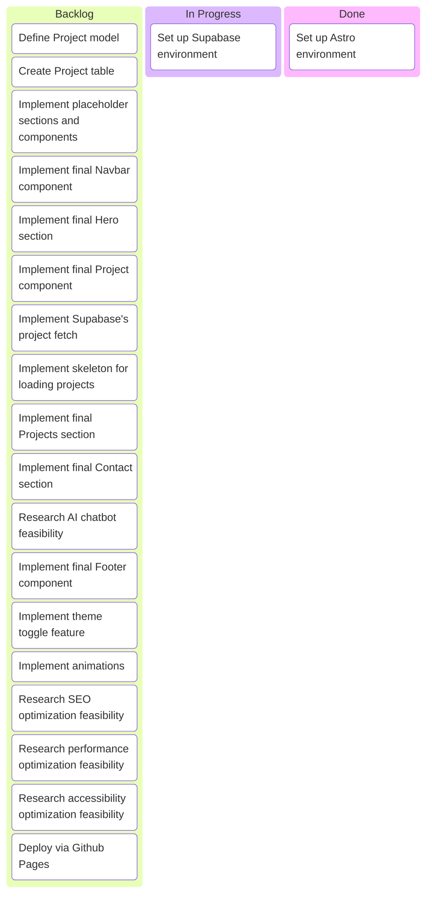

```mermaid
kanban
  stage1[Backlog]
    card3[Define Project model]
    card4[Create Project table]
    card5[Implement placeholder sections and components]
    card6[Implement final Navbar component]
    card7[Implement final Hero section]
    card8[Implement final Project component]
    card9[Implement Supabase's project fetch]
    card10[Implement skeleton for loading projects]
    card11[Implement final Projects section]
    card12[Implement final Contact section]
    card13[Research AI chatbot feasibility]
    card14[Implement final Footer component]
    card15[Implement theme toggle feature]
    card16[Implement animations]
    card17[Research SEO optimization feasibility]
    card18[Research performance optimization feasibility]
    card19[Research accessibility optimization feasibility]
    card20[Deploy via Github Pages]
  stage2[In Progress]
    card2[Set up Supabase environment]
  stage3[Done]
    card1[Set up Astro environment]
```