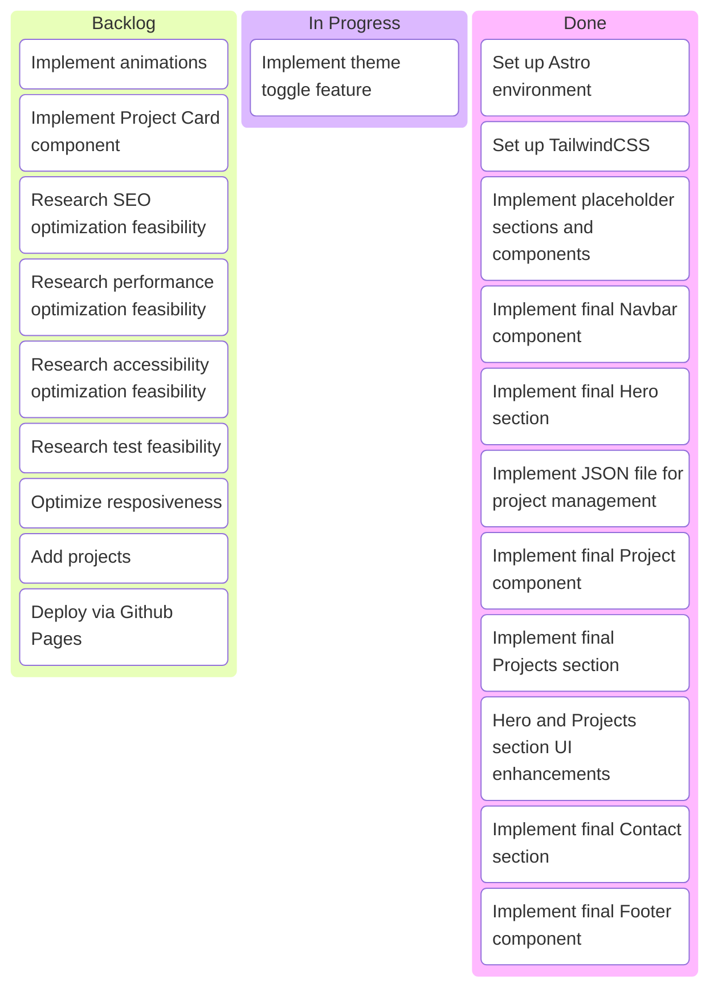

```mermaid
kanban
  stage1[Backlog]
    card16[Implement animations]
    card27[Implement Project Card component]
    card17[Research SEO optimization feasibility]
    card18[Research performance optimization feasibility]
    card19[Research accessibility optimization feasibility]
    card21[Research test feasibility]
    card23[Optimize resposiveness]
    card25[Add projects]
    card20[Deploy via Github Pages]
  stage2[In Progress]
    card15[Implement theme toggle feature]
  stage3[Done]
    card1[Set up Astro environment]
    card24[Set up TailwindCSS]
    card5[Implement placeholder sections and components]
    card6[Implement final Navbar component]
    card7[Implement final Hero section]
    card22[Implement JSON file for project management]
    card8[Implement final Project component]
    card11[Implement final Projects section]
    card26[Hero and Projects section UI enhancements]
    card12[Implement final Contact section]
    card14[Implement final Footer component]
```